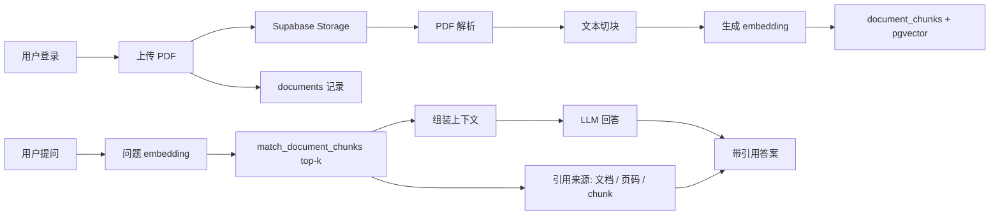

# 论文知识库助手

一个面向前端学习和求职作品集的 RAG 应用：上传 PDF，解析文本，切块向量化，基于向量检索回答问题，并展示引用来源。

当前仓库已经完成第 1 周的纯前端优先版本：登录壳子、文档库、上传 UI、文档详情、问答页、引用来源、评估页和 mock API。后续可以逐步把 mock 数据替换成 Supabase、PDF 解析、embedding 和 pgvector。

## 功能特性

- 登录页和用户隔离说明，下一阶段接 Supabase Auth。
- 文档库页面，展示 PDF 上传、索引状态、页数和 chunk 数量。
- 上传组件，支持 PDF 校验、进度、成功和错误状态。
- 文档详情页，展示解析状态和文本切块预览。
- 论文问答页，模拟 top-k 检索、回答生成和引用来源卡片。
- 评估页，展示 Recall@5、Citation Hit、Keyword Match 和平均延迟。
- API route 骨架，覆盖上传、文档列表、索引、问答、评估运行。
- 本地 RAG 工具函数，包含切块、模拟 embedding、cosine 检索和评估计算。
- Supabase schema 草稿，包含 RLS、pgvector、match RPC 和核心表。

## 技术栈

- Next.js App Router
- React
- TypeScript
- Tailwind CSS
- lucide-react
- Supabase Auth / Storage / Postgres / pgvector
- OpenAI-compatible embeddings and chat API
- Vercel

## 系统架构



## 数据流

1. 用户登录后进入文档库。
2. 上传 PDF 到 Storage，并写入 `documents`。
3. 服务端解析 PDF，每页提取文本。
4. 文本按页和长度切成 chunks。
5. 每个 chunk 生成 embedding，写入 `document_chunks`。
6. 用户提问时，问题也生成 embedding。
7. 调用 `match_document_chunks` 检索 top-k 片段。
8. 将检索片段放入 prompt，要求模型只基于上下文回答。
9. 前端展示回答和引用来源。
10. 写入 `qa_logs`，评估页统计命中率和延迟。

## 本地运行

```bash
npm install
npm run dev
```

访问 `http://localhost:3000`，默认会跳转到 `/dashboard`。

## 环境变量

复制 `.env.example` 为 `.env.local`，并填入真实服务配置。

```bash
NEXT_PUBLIC_SUPABASE_URL=
NEXT_PUBLIC_SUPABASE_ANON_KEY=
SUPABASE_SERVICE_ROLE_KEY=
OPENAI_API_KEY=
OPENAI_BASE_URL=https://api.openai.com/v1
EMBEDDING_MODEL=text-embedding-3-small
CHAT_MODEL=gpt-4.1-mini
```

## 数据库表

- `documents`：用户上传的 PDF 文档，包含文件地址、状态、页数、chunk 数。
- `document_chunks`：文档切块，包含页码、chunk 序号、正文和 embedding。
- `qa_logs`：用户问题、模型回答、引用来源和耗时。
- `eval_cases`：评估问题、期望关键词和期望来源页码。

SQL 草稿位于 `supabase/schema.sql`。

## API 设计

- `GET /api/documents`：返回当前用户文档列表。
- `POST /api/upload`：上传 PDF 并创建文档记录。
- `POST /api/documents/:id/index`：解析、切块、向量化并写入索引。
- `POST /api/chat`：检索 top-k chunks，调用模型，返回回答和来源。
- `POST /api/eval/run`：运行评估集并返回指标。

当前 `src/lib/rag.ts` 使用 deterministic local embedding 模拟向量检索，方便无 API key 时学习和演示。接入真实模型时，把 `textToLocalEmbedding` 替换为 embedding API 调用，并将 `retrieveRelevantChunks` 替换为 Supabase RPC `match_document_chunks` 即可。

## 评估指标

| 指标 | 含义 |
| --- | --- |
| Recall@5 | 期望页码是否出现在 top 5 检索结果中 |
| Citation Hit | 最终回答引用是否命中期望页码 |
| Keyword Match | 回答是否包含期望关键词 |
| Latency | 单次问答端到端耗时 |

## 当前进度

- 第 1 周：已完成前端产品壳子和 mock 闭环。
- 第 2 周：待接入 Supabase Auth、Storage、documents 表和 PDF 解析。
- 第 3 周：待接入切块、embedding 和 pgvector 检索。
- 第 4 周：待接入真实 RAG 问答、引用来源和 qa logs。
- 第 5 周：待补完整评估集、截图、部署和简历描述。

## 改进方向

- 支持 OCR 扫描版 PDF。
- 增加 reranker，提高引用命中率。
- 增加流式回答。
- 增加多文档对比问答。
- 增加后台任务队列，避免长时间索引阻塞请求。
- 增加 Docker 部署方案。
- 增加 GitHub Actions 检查。

## 简历描述参考

开发论文知识库助手，支持 PDF 上传、文本解析、分块向量化、基于 pgvector 的语义检索和带引用来源的 RAG 问答。实现用户隔离、文档索引状态管理、top-k 检索、引用页码展示，并构建基础评估集统计 Recall@5、Citation Hit Rate 和响应延迟，项目可部署至 Vercel/Supabase。

## 学习记录

- 我完成了 Next.js 项目的 GitHub 首次上传。
- 我理解了项目根目录里 `src`、`public`、`package.json`、`README.md` 的作用。
- 新建了注册页面
- 我知道了 `node_modules`、`.next`、`.env.local` 不应该上传 GitHub。
- 下一步准备接入 Supabase Auth，实现真实登录和注册。

- 接入supabase auth，实现登录和注册
